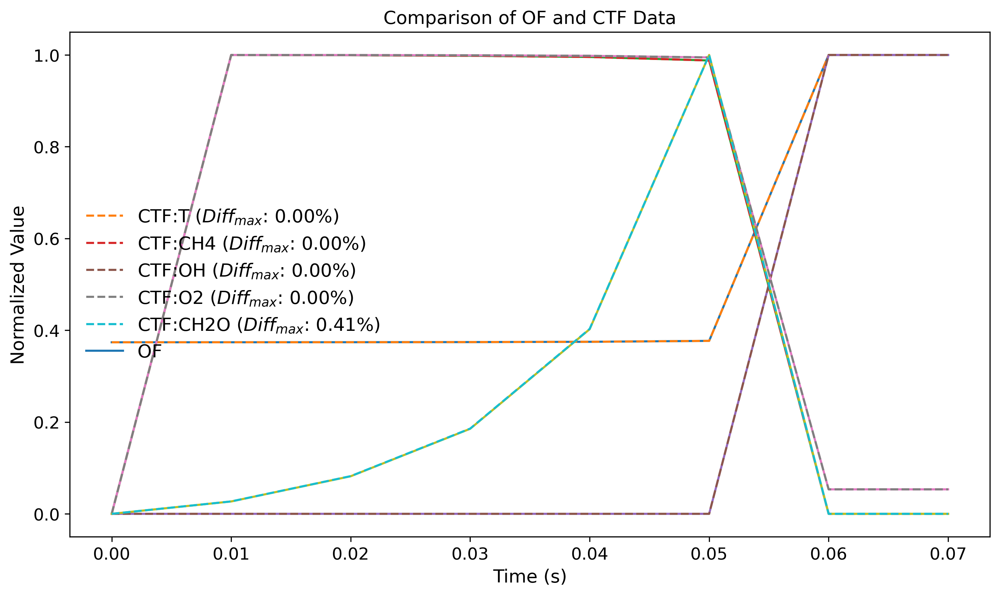
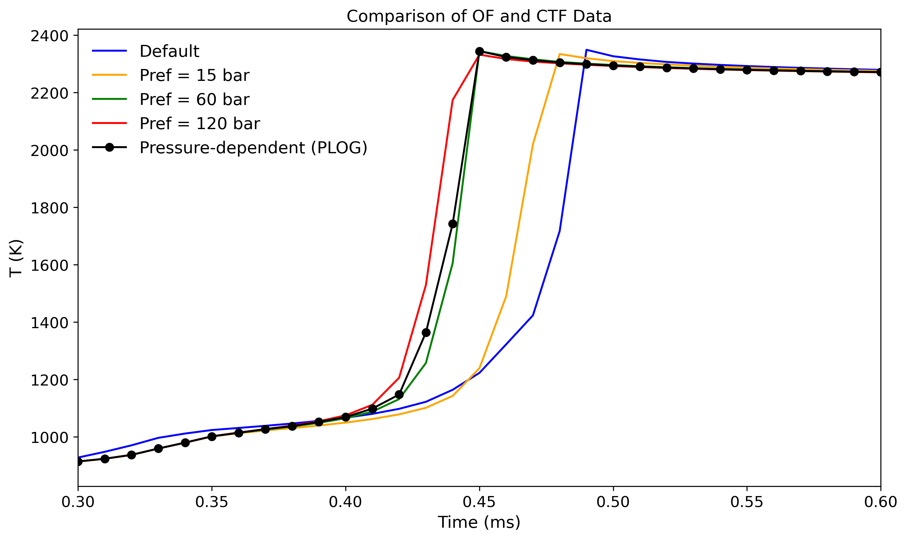

# canteraToFoam

[](https://github.com/OpenFOAM/OpenFOAM-10)

This repository provides a lightweight utility to convert **Cantera YAML chemical mechanisms** into **OpenFOAM-10** compatible files. It supports pressure-dependent reactions and offers options to either embed PLOG data or evaluate the mechanism at a specific reference pressure.

---

## 🛠 Requirements

* **OpenFOAM-10**
  (Test cases require the `chemFoam` application from this version)
  Note: Support for other versions is on the way.
* **Python 3** with the `Cantera` package installed

---

## 🚀 Basic Usage

Run the converter by specifying:

* A directory containing `chem.yaml` and `transportProperties` (in OpenFOAM format using Sutherland coefficients)
* An output directory

```bash
python convert.py <cantera_mech_dir> <output_dir>
```

To evaluate pressure-dependent reactions at a specific pressure (in **bar**), use:

```bash
python convert.py <cantera_mech_dir> <output_dir> --pressure 60
```

If no pressure is specified, pressure-dependent reactions are written using OpenFOAM’s `ArrheniusPLOG` format.

> ⚠️ **Note:** OpenFOAM does not natively evaluate PLOG expressions. External libraries must be required, such as:
>
> * [OpenFOAM-8 PLOG support](https://github.com/ZmengXu/PLOGArrheniusReactions)
> * [OpenFOAM-10 PLOG support](https://github.com/yuchenzh/plogOF10)


---
## 🧪 Testing

Two helper scripts are included:

* `./Allconvert` – batch converts example mechanisms in `./mechs`
* `./Alltest` – runs conversion and executes `chemFoam` test cases

Results are saved in the `results/` directory with CSV files and plots.

---

## 📊 Results

### 1. GRI Mechanism (No PLOG)

Comparison between `chemkinToFoam` and this converter. Ignition delay times show good agreement.



---

### 2. Xu Mechanism with PLOG

Source:
[Xu et al., 2022](https://www.sciencedirect.com/science/article/pii/S0016236122026564)

Demonstrates how different reference pressures lead to varying behaviors in ignition delay.



---

## 🔭 Future Work

* Extend support for PLOG mechanisms from **OpenFOAM-7** to **OpenFOAM-13**


---

Here's a polished **Acknowledgements** section you can add to your `README.md`:

---

## 🙏 Acknowledgements

Special thanks to the following contributors whose work inspired and enabled key features of this project:

* [@ZmengXu](https://github.com/ZmengXu) – for implementing PLOG functionality in OpenFOAM
* [@Yue0105Qiu](https://github.com/Yue0105Qiu) – for developing methods to evaluate PLOG coefficients at a specific reference pressure

Their contributions significantly advanced the compatibility and flexibility of chemical kinetics in OpenFOAM.


